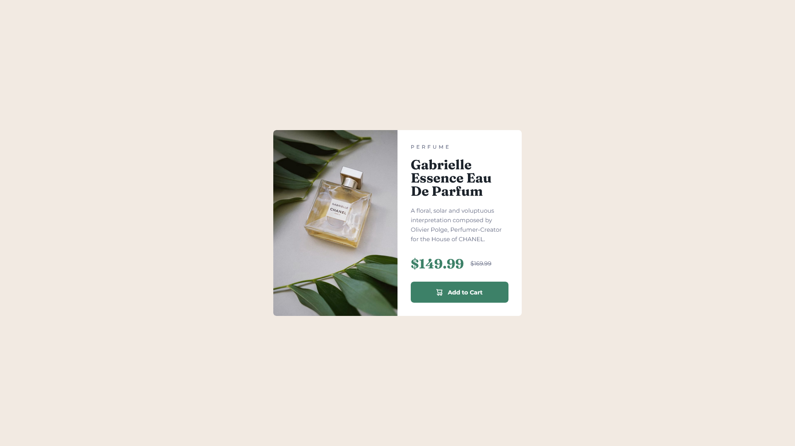

# Frontend Mentor - Product preview card component solution

This is a solution to the [Product preview card component challenge on Frontend Mentor](https://www.frontendmentor.io/challenges/product-preview-card-component-GO7UmttRfa). Frontend Mentor challenges help you improve your coding skills by building realistic projects.

## Table of contents

- [Overview](#overview)
  - [The challenge](#the-challenge)
  - [Screenshot](#screenshot)
  - [Links](#links)
- [My process](#my-process)
  - [Built with](#built-with)
  - [What I learned](#what-i-learned)
  - [Useful resources](#useful-resources)
- [Author](#author)
- [Acknowledgments](#acknowledgments)

## Overview

### The challenge

Users should be able to:

- View the optimal layout depending on their device's screen size
- See hover and focus states for interactive elements

### Screenshot

### Links

- Solution URL: [Add solution URL here]()
- Live Site URL: [Add live site URL here]()

## My process

### Built with

- Semantic HTML5 markup
- Flexbox
- CSS Grid
- Mobile-first workflow
- [TailwindCSS][tailwinddocs]
- [Parcel](https://parceljs.org/docs) - for simple static site building

### What I learned

This is the first time I used the `picture` element. The web.dev entry about this element was very helpful. I learned how to use `source` with the `srcset` attribute and the `media` attribute to help supplement different versions of images for different devices, screen sizes, and layouts.

### Useful resources

- [TailwindCSS Docs][tailwinddocs]
- [web.dev - The picture element](https://web.dev/learn/design/picture-element)

## Author

- Website - [JYLN](https://jyln.dev)
- Frontend Mentor - [@JYLN](https://www.frontendmentor.io/profile/JYLN)

[tailwinddocs]: https://tailwindcss.com/docs

## Acknowledgments

- [Kevin Powell](https://github.com/kevin-powell)
